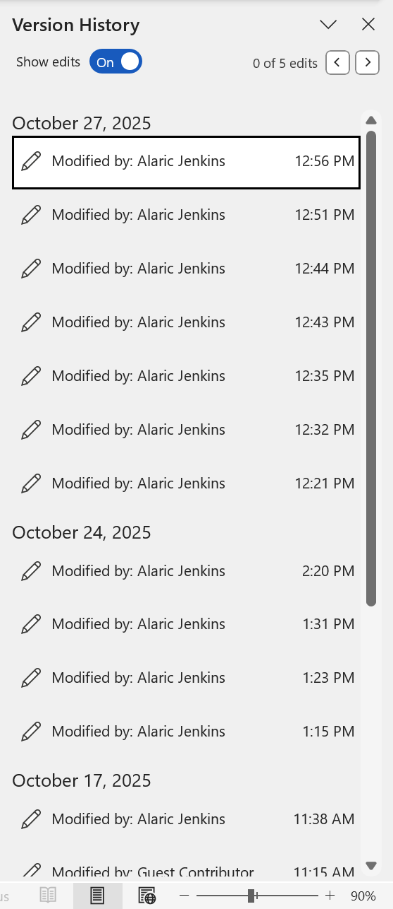
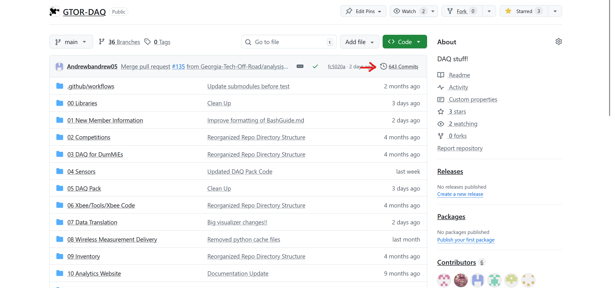
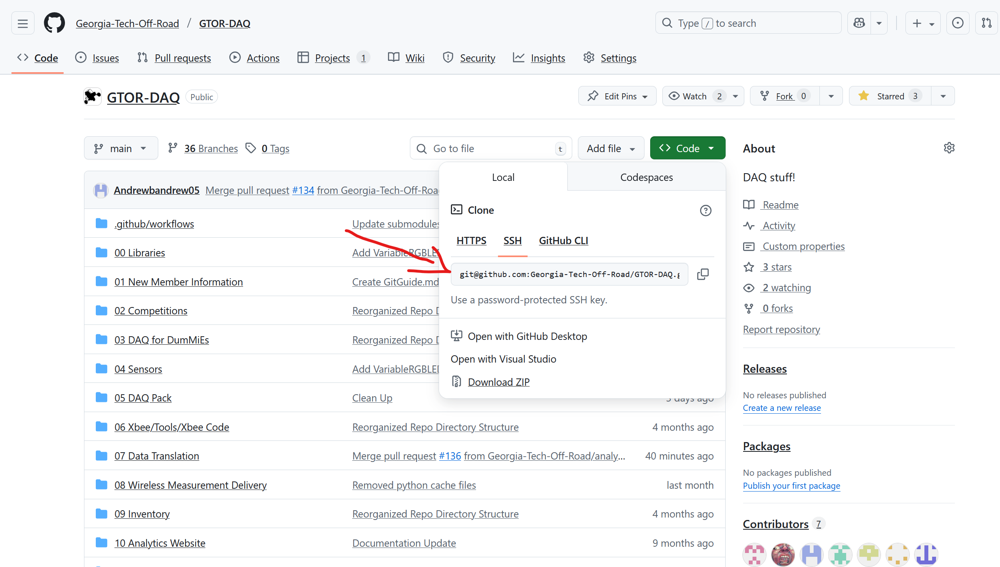

# About Git
Git is a version control system, just like file history on word or google docs. However, git is specifically design for programming and incredibly useful features to allow developers to collaborate together. 

# Installing Git

Follow the directions at this [link](https://git-scm.com/), all default options should work. To verify that your installation is succesful, open a new terminal window*. In your terminal, run ``git -v``. If you receive a response that looks something like this (exact version is not important): ``git version 2.49.0.windows.1`` then git is installed succesfully!

# Basics of git

Git stores versions of your codebase (called "commits"), in a delta based format. In this context a delta, just like $\delta$ in math, means a difference from one version to the next. Rather than store a copy of all your files for each version, git only stores the difference (delta) between commits.  

**Note:**Your terminal will depend on your operating system. If you are on Windows downloading git will have installed "Git Bash". If you are MacOS, you will have an application handily called "Terminal". If you are Linux, just pull up your terminal.

Going back to our comparison with a Word or Google Doc history. Commits in git are analogous to the time stamps you see in version history:

**Word Version History**  
  
If you go to our main [GitHub repository](https://github.com/Georgia-Tech-Off-Road/GTOR-DAQ) you can find our commits

**GitHub Homepage**

**GitHub Commit History**

Notice that each commit is not associated with a timestamp. Word and Docs tries to guess when to separate your document into different versions. The problem with this is that it doesn't always guess correctly! With Git, you define exactly when you would like to create a commit and what changes go into it.

# Downloading Repository
Before we can start programming, we need to download the entire repository to our local computer. You can download a Git repository by running the following command in your terminal:
``git clone [repository-url]``
This will clone (download) the repository to a directory in your current working directory. For example, to download our main repository, I would run the following command:
``git clone git@github.com:Georgia-Tech-Off-Road/GTOR-DAQ.git``

You can find the URL on GitHub by clicking on the <> Code dropdown:

