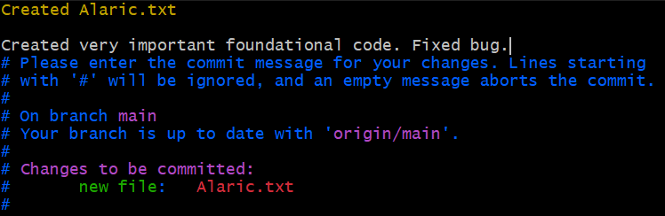

# About Git
Git is a version control system, just like file history on word or google docs. However, git is specifically design for programming and incredibly useful features to allow developers to collaborate together. 

# Installing Git

Follow the directions at this [link](https://git-scm.com/), all default options should work. To verify that your installation is succesful, open a new terminal window*. In your terminal, run ``git -v``. If you receive a response that looks something like this (exact version is not important): ``git version 2.49.0.windows.1`` then git is installed succesfully!

**Note:**Your terminal will depend on your operating system. If you are on Windows, downloading git will have installed "Git Bash". If you are MacOS, you will have an application handily called "Terminal". If you are Linux, just pull up your terminal.

# Basics of git

## Git Repositories
GTOR-DAQ: [https://github.com/Georgia-Tech-Off-Road/GTOR-DAQ](https://github.com/Georgia-Tech-Off-Road/GTOR-DAQ)
Follow the link above to our GitHub repository. A repository is similar to a shared Google Drive folder. A repository should contain all necessary source code files for the project. This main repository is an aggregate of all our different projects!

## Git Remotes
A online version of a Git repository is called a "remote". For example [https://github.com/Georgia-Tech-Off-Road/GTOR-DAQ](https://github.com/Georgia-Tech-Off-Road/GTOR-DAQ) is the remote for the GTOR-DAQ repository.

## Understanding Commits and Deltas
Git stores versions of your codebase (called "commits") in a delta based format. In this context a delta, just like $\delta$ in math, means a difference from one version to the next. Rather than store a copy of all your files for each version, git only stores the difference (delta) between commits.  

Going back to our comparison with a Word or Google Doc history. Commits in git are analogous to the time stamps you see in version history:

**Word Version History**  
  
If you go to our main [GitHub repository](https://github.com/Georgia-Tech-Off-Road/GTOR-DAQ) you can find our commits
  
**GitHub Homepage**

  
**GitHub Commit History**

Notice that each commit is not associated with a timestamp. Word and Docs tries to guess when to separate your document into different versions. The problem with this is that it doesn't always guess correctly! With Git, you define exactly when you would like to create a commit and what changes go into it.

## Cloning(Downloading) a Repository
Before we can start programming, we need to download the entire repository to our local computer. You can download a Git repository by running the following command in your terminal:
``git clone [repository-url]``
This will clone (download) the repository to a directory in your current working directory. For example, to download our main repository, I would run the following command:
``git clone git@github.com:Georgia-Tech-Off-Road/GTOR-DAQ.git``

You can find the URL on GitHub by clicking on the <> Code dropdown:
  

## Git Add

  
Git works on the principle of checkpoints, which you can see on the diagram above (Thank you very much to reddit user who created this). The GitHub repository is the final source of truth of the project. The code on the repository should be validated and bug free. On the other hand our local clone (copy) of the repository is a place for experimentation. If Git worked liked a Word document, and changes you made on your local version of the repository would immediately be reflected on GitHub. This is dangerous! Imagine if git worked liked this. If you make an error in your code, then the GitHub repository immediately is updated with your bug. Suddenly the code is buggy and no one can work!  

The first checkpoint is moving your changes from your working tree (file system) to a staging area.  Imagine I have cloned this [practice repository](https://github.com/Georgia-Tech-Off-Road/GITPractice). I am working on a verrry important file called "Alaric.txt" and I have just wrote the initial code for my file:
  

In the same directory (folder) as the "Alaric.txt", I run ``git status``  
  
Notice that it says that "Alaric.txt" is untracked. This means that git has never encountered this file and is not tracking is version history. Let fix this by running ``git add Alaric.txt``:  
  
Notice now that after running ``git status``, "Alaric.txt" is in "Changes to be Committed", also known as the staging area. If I were to run ``git commit``, any changes in the staging area will be part of the commit.
Before we do that though, I just realized there is a bug in my code, I quickly type out the fix:
  
Let's run ``git status`` again, will new line be in the staging area?  
  
The answer is no, notice that "Alaric.txt" has changes in the staging area (the first line) and changes not staged (the second line). For simplicity sake I will not show them in this tutorial, but there are more advanced ways to select only one certain changes in the file to be commited. In our scenario though, we want the bug fix to be comitted alongside our very important code. We can remedy this by running ``git add Alaric.txt`` again:  
  
Notice now, when we ran ``git status``, all the changes in "Alaric.txt" are in the staging area.

If we refer back to the workflow diagram, we have moved our changes from our working tree to the staging area:
  

# Git Commit
Let's commit these changes. To commit changes run ``git commit``:  
  
 When this runs it will open up a file / code editor. On my system this is vim (a command line code editor). For most people, the default seems to be VS Code. Either way, the process is the same. On the very first line, enter a title for your commit. Then, leaving a line between the title and your message, type out the message for your commit:
  
 When your ready to complete the commit, save the file and close out the editor. If you do not want to commit (say you forgot to include a file), leave an empty commit message, save the file, and close the editor. This will abort the commit.

To verify that we've commited, run ``git log``:  
  
You can see the most recent commit that we've made.

We have now moved our code changes from the staging area to the version history of our local repository. On the diagram, this is labeled as "Local Branch", ignore this terminology for now. 
  

# Git Push
Finally, it is time to push our new commit to GitHub. The command for this is quite simple: ``git push``:  
  
If you go the the [GitHub repository commit history](https://github.com/Georgia-Tech-Off-Road/GITPractice/commits/main/), you will see this commit (you might have to scroll down some):
  

On the diagram we have moved our changes from our local repository to the remote (GitHub):  
  

Recall that remotes are how we refer to online versions of our git repository. Internally, GitHub is storing the repository just as on your computer. It is just has a bunch of handy features built on top! 

# Git Pull
Finally, imagine that I am different person on another computer. To check if there are any new changes, I run ``git status``:
  
I see that that there is a new commit on our remote (origin/main). I would like to get the new changes! To do this (as git helpfully points) I run ``git pull``:  
  
When I run ``git pull`` it tells me what file(s) are updated, and some details about the updates (insertions, deletions, etc.). Let's run ``git log`` to see the new commit:  
  
Awesome we see the new commit on this computer! We have now completed the lifecycle of making changes in git. We have gone through how to push changes to GitHub, using git add to move changes from our working tree to the staging area, using git commit to bundle these changes together, and using git push to push our new commits to GitHub. To update the our local version of the repository, we run ``git pull`` to bring in new changes from GitHub. These commands are the basics of working with git!  
  

# Advanced: Git Branching

So far we have shown the basics of using git. However, there is one problem with our current setup. Imagine if two people would like to be working on the same repository at the same time. This would not work with our current linear setup! Person A needs to make their changes, then ``git push`` their commits to GitHub. Only then can Person B update their local repository with ``git pull``, make their changes, and ``git push``. The cycle repeats. But what if Person A and Person B want to work on different parts of the codebase at the same time? Our solution to this is git branches. With branches you can have can have a parallel, version history (Person A and Person B working at the same time) and merge the two branches together. I cannot adequately explain branching properly, but there is a very good [interactive online tutorial](https://learngitbranching.js.org/?locale=en_US) you should follow.
