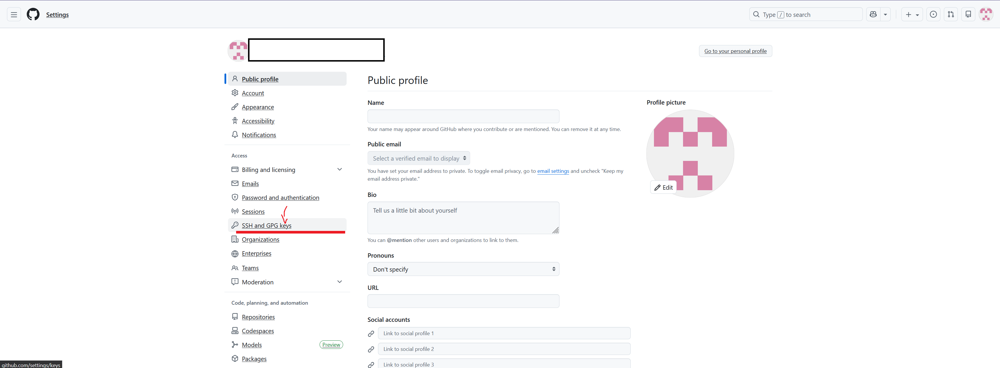

Overview
========

Whenever you interact with GitHub, such as pushing code changes, GitHub
must have a way to identify you from your local computer that made the
push request (i.e with ``git push``). One way to do this is have you
enter your login credentials whenever you make a push. This method of
authentication uses the HTTP URL of the GitHub repository (e.g
https://github.com/Georgia-Tech-Off-Road/GTOR-DAQ.git). As one can
imagine, entering login information one every push becomes arduous and
annoying. Additionally, for some reason we have had issues with members
cloning (downloading) our GitHub repositories’ pub URLs, even when the
repositories are public. Because of these issues, it is recommended to
use an another identity authentifier: Secure Shell Protocol (SSH).

SSH provides secure communication between systems using a public and a
private key. As their names suggest, the public key is known to both
parties, while the private key is known only to the sender. A famous
example of public-private key cryptography is RSA encryption. RSA
encryption uses the inherent fact that the time to find the prime
factors of large numbers grows extremely rapidly (polynomial time
complexity), while multiply and exponentiating grow at a far slower
pace. With public-private encrpytion, the sender uses the private key to
encrypt the message (the method varies based on the encryption
technique). The recepient, who knows only the public key, uses the
public key to decrypt the message. Going back to our example with RSA
encryption, the calculation to decrypt the encrypted message can be done
reasonably fast. However, finding the key that encrypt the message is
practically impossible, even with today’s best supercomputers (future
Quantum computers will be able to crack RSA encryption). I hope this
paragraph gives you a rough idea on how GitHub can verify your identity
with SSH and public private keys.

Generating the SSH Keys
=======================

Now let’s actually get to generating these keys for GitHub! For this
guide, I will roughly follow `this
article <https://docs.github.com/en/authentication/connecting-to-github-with-ssh/generating-a-new-ssh-key-and-adding-it-to-the-ssh-agent>`__
from GitHub. First, open the terminal of your choice. If you are on
Windows I recommend using Powershell, on Mac use the “terminal”
application, if you are on Linux or (god forbid) another operating
system, you should know what to do. In your terminal prepare the
following command: ``ssh-keygen -t ed25519 -C "your_email@example.com"``

Please change “your_email@example.com” to your GitHub email address! Now
hit enter to run the command. Unless you know what you’re doing, please
use the default options by pressing enter at each prompt. This will
create a public key (file ending in .pub) and a private key (no file
extension) at the default location. Next run, the following command to
start the SSH agent to manage SSH connections:
``eval "$(ssh-agent -s)"``

Finally, add the key to the agent with: ``ssh-add ~/.ssh/id_ed25519`` If
you use specified a differnet name for the key other than the default
when running ``ssh-keygen``, please replace ``~/.ssh/id_ed25519`` with
the path to your file. Verify that the your key has been added
sucessfully by running ``ssh-add -l``.

Note that this has only added the ssh key to your current terminal
session. If you close the window and re-open it, you would rerun the
``eval`` and ``ssh-add`` again. This is quite annoying.

It’s relatively common to want commands to be run on terminal startup.
Virtually every terminal and/or operating system provides some file in
which to write these start up commands. On Windows (Git Bash) and most
Linux distros, this should be ~/.bashrc (~ is a stand in for your system
defined user home directory), on MacOS this file is typically ~/.zshrc.

In this file add the following script which I have shamelessly taken
from `this GitHub
article <https://docs.github.com/en/authentication/connecting-to-github-with-ssh/working-with-ssh-key-passphrases>`__:

::

   env=~/.ssh/agent.env

   agent_load_env () { test -f "$env" && . "$env" >| /dev/null ; }

   agent_start () {
       (umask 077; ssh-agent >| "$env")
       . "$env" >| /dev/null ; }

   agent_load_env

   # agent_run_state: 0=agent running w/ key; 1=agent w/o key; 2=agent not running
   agent_run_state=$(ssh-add -l >| /dev/null 2>&1; echo $?)

   if [ ! "$SSH_AUTH_SOCK" ] || [ $agent_run_state = 2 ]; then
       agent_start
       ssh-add
   elif [ "$SSH_AUTH_SOCK" ] && [ $agent_run_state = 1 ]; then
       ssh-add
   fi

   unset env

If you did not use the default ssh key, you will need too change two
``ssh-add`` to ``ssh-add (path to your private key)``. What does this do
differently from ``eval`` and ``ssh-add``? I’m not completely sure. I
have used this for years and it works perfectly, so I’m hesistant to try
something else. I believe this effectively does the same thing, with
slightly more error checking. Once you have saved your .bashrc / .zshrc
file, close your terminal session and run ``ssh-add -l`` to make sure
your key has been properly added. We have generated a public and a
private key, started and added it to our SSH agent. All that is left is
to give your public key to GitHub!

Adding an SSH Key to GitHub
===========================

To add an SSH key to GitHub, login to your GitHub account. Got to
settings>SSH and GPG Keys>New Key: |image0|

Give your key a title descptive to the computer you are using and copy
THE PUBLIC KEY (ending in .pub) that you generated to the prompt. Hit
“Add SSH Key”.

Using SSH Keys with GitHub
==========================

Your SSH key should be all setup and ready to use. However, to use SSH
protocol, you will need to make sure that you clone and interact with
repository’s using their SSH URLs (not HTTPS). You can get the SSH URL
for a repository by going the repository’s homepage on GitHub, hitting
“<> Code”(Above the file tree and to the right) and making sure “SSH”
not “HTTPS” is selected: ~\ ` <Images/github_url.png>`__

