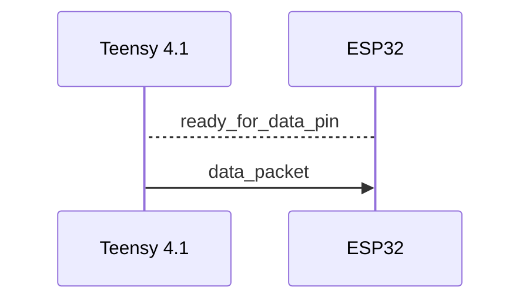

## Definitions

Teensy 4.1: Microcontroller in charge of data conversion  

ESP32: ESP32 microcontroller in charge of wireless transmission and coordination with outside sources  

ready_for_data_pin: A physical connection that the ESP32 sets when it is ready (space available in buffer) to receive data  

data_packet: A packet of data collected from the vehicle. data_packet is sent over SPI which the ESP32 receives. The size of data packet is predefined upon program initialization.